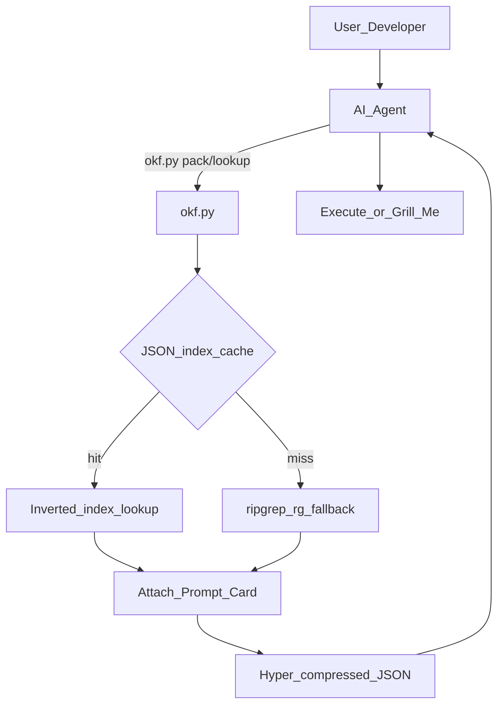

# OKF Cognitive Bundle

How the Aegis Open Knowledge Format keeps agents **grounded** and **token-cheap**.

## Pluggable modules

A bundle is a version-controlled tree (`_okf_knowledge/` + DNA in `AGENTS.md`) you can drop into another team/repo. Zones:

| Zone | Path | Role |
| --- | --- | --- |
| Inbox | `_inbox/` | Untriaged notes |
| Kernel | `kernel/` | `okf.py` + compile/pack/lint |
| Law | `standards/` | Binding MUST/SHOULD + Prompt Cards |
| Memory | `vault/` | Concepts, playbooks, systems, incidents, references |

## Atomic knowledge

One topic per markdown file with YAML frontmatter (`type`, `title`, `description`, `tags`, …). Prefer small linked pages over monolithic dumps. Schema: [OKF House Schema](/standards/okf-house-schema.md).

## Traversable graph

[`index.md`](/index.md) is the hub. Use **explicit relative links** so agents map relationships without inventing neighbors from vector similarity alone. Compiled `graph.json` / `index.json` are for **tools**, not for pasting into prompts.

## Token path



1. `okf.py compile` → inverted `index.json` + `prompt_cards.json`
2. `okf.py pack` / `lookup --card` → **cache hit:** instant inverted lookup; **cache miss / empty lexical hits:** **`rg` only** (never `grep`) over brain markdown
3. Attach mapped Prompt Cards; emit compact JSON/markdown (no chatty wrappers)
4. Optional deep read of paths the **current** cards name
5. Repo corpus via targeted Glob/`rg`/Read
6. Live upstream only on cache miss; write-back durable pins to `_inbox/`

IDE-side bans and hygiene: [IDE Context Guardrails](/standards/ide-context-guardrails.md). Pack ladder: [OKF Prompt Injection](/standards/okf-prompt-injection.md).


## Why JSON caches

Local inverted index and cards stay **JSON**. LLMs parse JSON reliably; custom/exotic wire formats (e.g. TOON as LLM ingest) add error and token overhead without helping pack quality.

## Autonomy and grill-me

Agents **SHOULD** run `compile` after durable brain mutations and may refresh indexes when files change. **Grill-me** remains a first-class multi-turn workflow — do not replace it with a rigid turn counter.

## Prompt Card

```text
OKF bundle: atomic md + index.md links; pack cards only (no graph paste).
Lookup: JSON inverted hit → else ripgrep (rg), never grep → Prompt Cards → compact JSON.
Grill-me stays multi-turn; compile after brain mutations.
```

# Related

- [Extending Aegis](extending-aegis.md)
- [IDE Context Guardrails](/standards/ide-context-guardrails.md)
- [Maintain aegis-system](/vault/playbooks/maintain-aegis-system.md)
