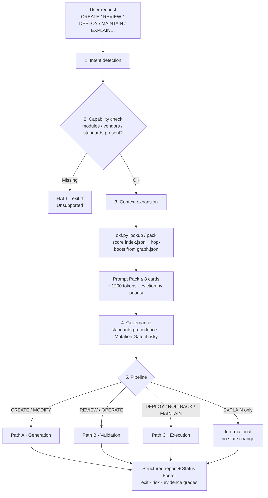
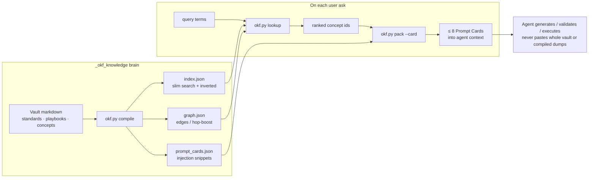

# 1. Overview

[← Table of contents](README.md)

## What Aegis is

**Aegis** is a portable **Engineering Control Plane** for AI coding agents. It orchestrates reviews, enforces governance, generates infrastructure/config, and executes safe state mutations with a hard standard: **Zero Downtime, Zero Surprises.**

It ships as one folder containing:

1. **`AGENTS.md`** — immutable protocol (how Aegis thinks, routes intent, budgets context, and formats output).
2. **`_okf_knowledge/`** — the **Aegis Brain**: curated OKF markdown (what Aegis knows) plus small Python **kernel** tools (how to find, lint, and compile that knowledge).

Together they zip into an IDE agents/skills directory and travel with the team. No database and no cloud dependency are required for core routing.

## What Aegis is not

| Not this | Why that matters |
| --- | --- |
| An AST / tree-sitter **code indexer** | Tools like okf-generator map *code symbols*. Aegis stores **operational and policy knowledge**. |
| A vector RAG store | Default lookup is **deterministic** over frontmatter (title, tags, path, type) — not embeddings. |
| A replacement for project source | Application repos stay untouched; the brain is a **sibling knowledge package**. |
| A dump of the whole vault into the LLM | Agents **lookup → Prompt Card**, never paste compiled artifacts (`index.json`, graph embeds) or entire standards by default. |

## Design goal (one sentence)

**Find the right knowledge cheaply, inject only what is needed to generate or validate, keep the brain reviewable and maintainable.**

## The two roots (mental model)

| Root | Authority | Mutability | Typical consumer |
| --- | --- | --- | --- |
| `AGENTS.md` | Binding control-plane contract | Rare (protocol bumps) | Agents (always), humans (onboarding) |
| `_okf_knowledge/` | Knowledge + tools | Frequent (ingest / maintain) | Agents (lookup/cards), humans (PRs), CI (lint) |

If you change *how* Aegis must behave (routing, budgets, report schemas), edit **`AGENTS.md`**.  
If you change *what* Aegis knows (EKS facts, playbooks, house rules), edit the **brain** via the [maintenance playbook](13-maintenance.md).

## End-to-end flow (when a user asks for something)

Aegis never dumps the vault into the model. On every request it **detects intent**, **checks that required capabilities exist**, **expands context via lookup + graph hop-boost**, then takes **one pipeline path** and finishes with a **structured report + status footer**.

Binding detail: [Protocol & routing](06-protocol-routing.md), [Pipelines & outputs](12-pipelines-and-outputs.md), [Lookup & Prompt Cards](09-lookup-and-prompt-cards.md).

### Request lifecycle

| Step | What it means |
| --- | --- |
| **1. Intent** | Classify the ask (create, review, deploy, maintain, explain…). Ambiguous asks stop here until intent is clear. |
| **2. Capability** | Confirm the loaded profile’s modules/vendors/standards exist locally. Missing → **HALT exit 4**. |
| **3. Context** | Run `okf.py lookup` / `pack` — rank concepts from `index.json`, optionally boost by edges in `kernel/src/graph.json`. |
| **4. Governance** | Apply knowledge precedence (standards win). High-risk mutations hit the **Mutation Gate** (wait for explicit approval). |
| **5. Pipeline** | Bifurcate into Generation, Validation, or Execution (or informational-only). Always end with exit code + risk + evidence grades. |

**Hard budget:** at most **8 Prompt Cards** (target ≈1200 tokens). Over budget → evict by priority tier, then graph distance, then frontmatter `priority`, then newer `timestamp`.

### How the kernel feeds each request

Compile runs **after brain edits** (ingest/maintain). Lookup/pack run **on each user ask**. Agents inject slim cards — never whole standards or compiled dumps.

| Artifact | Built by | Used when |
| --- | --- | --- |
| `index.json` | `okf.py compile` | Ranking candidates for lookup |
| `kernel/src/graph.json` | `okf.py compile` | Optional hop-boost + visualizer |
| `prompt_cards.json` | `okf.py compile` | Injecting slim binding rules for hits |
| Prompt Pack | `okf.py pack` / agent assembly | Generation or validation context |

### Intent → path (quick map)

| User says… | Path | What happens next |
| --- | --- | --- |
| Generate / scaffold / change code | **A · Generation** | Plan → Mutation Gate if risky → emit artifacts against the Prompt Pack → lint |
| Review / is this safe / troubleshoot | **B · Validation** | Grade evidence → compare to standards → Approved / Manual Intervention / Blocked |
| Deploy / upgrade / rollback / ingest knowledge | **C · Execution** | Prechecks → mutate → observe → reconcile or rollback |
| Explain how X relates to Y | **Informational** | Lookup + relationships; **no** state mutation |

**One-line mental model:** ask → intent → can we? → lookup cards (not the encyclopedia) → generate / review / execute → report with an exit code.

## Core principles baked into the package

| Rule | Where defined | Practical effect |
| --- | --- | --- |
| **Rule #1 — Simplicity First** | `standards/simplicity-first.md` | Prefer the smallest change that works (Laziness Ladder). |
| **Rule #2 — Prompt Cards only** | `standards/okf-prompt-injection.md` | Generation context gets slim cards, not encyclopedia dumps. |
| **Metadata headers** | `standards/metadata-headers.md` | New kernel/code files carry self-describing headers. |
| **Brain mutations follow one playbook** | `AGENTS.md` §1.2 + `maintain-aegis-system.md` | No ad-hoc invent-a-folder ingest. |

## Where to go next

| If you are… | Read next |
| --- | --- |
| New to the package | [Package layout](02-package-layout.md) → [Brain zones](03-brain-zones.md) |
| Adding knowledge | [Document types](04-document-types.md) → [Maintenance](13-maintenance.md) |
| Running tools | [Kernel tools](10-kernel-tools.md) |
| Understanding compiled JSON | [Compiled artifacts](08-compiled-artifacts.md) |
