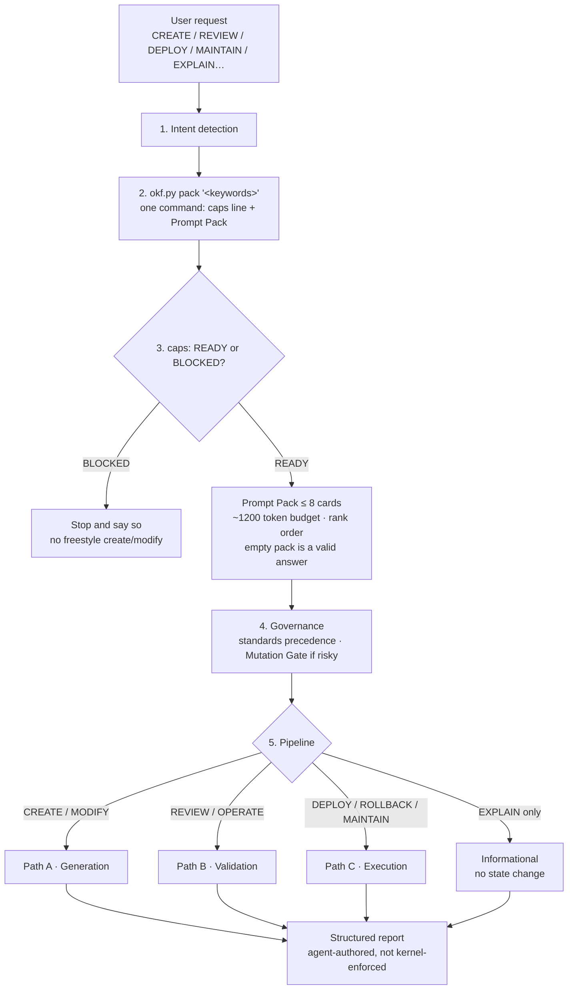
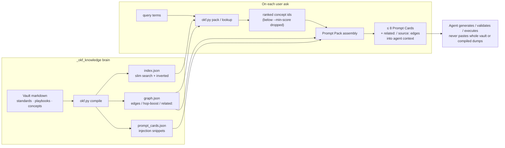

# 1. Overview

[← Table of contents](README.md)

## What OKF is

**OKF** is a portable **Engineering Control Plane** for AI coding agents. It orchestrates reviews, enforces governance, generates infrastructure/config, and executes safe state mutations with a hard standard: **Zero Downtime, Zero Surprises.**

It ships as one folder containing:

1. **`AGENTS.md`** — protocol (how OKF routes intent, retrieves context, and reports).
2. **`_okf_knowledge/`** — the **OKF Brain**: curated OKF markdown (what OKF knows) plus small Python **kernel** tools (how to find, lint, and compile that knowledge).

Together they zip into an IDE agents/skills directory and travel with the team. No database and no cloud dependency are required for core routing.

## What OKF is not

| Not this | Why that matters |
| --- | --- |
| An AST / tree-sitter **code indexer** | Tools like okf-generator map *code symbols*. OKF stores **operational and policy knowledge**. |
| A vector RAG store | Default lookup is **deterministic** over frontmatter (title, tags, path, type) — not embeddings. |
| A replacement for project source | Application repos stay untouched; the brain is a **sibling knowledge package**. |
| A dump of the whole vault into the LLM | Agents **pack → Prompt Card**, never paste compiled artifacts (`index.json`, graph embeds) or entire standards by default. |

## Design goal (one sentence)

**Find the right knowledge cheaply, inject only what is needed to generate or validate, keep the brain reviewable and maintainable.**

## The two roots (mental model)

| Root | Authority | Mutability | Typical consumer |
| --- | --- | --- | --- |
| `AGENTS.md` | Binding control-plane contract | Rare (protocol bumps) | Agents (always), humans (onboarding) |
| `_okf_knowledge/` | Knowledge + tools | Frequent (ingest / maintain) | Agents (pack/cards), humans (PRs), CI (lint) |

If you change *how* OKF must behave (routing, budgets, report shapes), edit **`AGENTS.md`**.  
If you change *what* OKF knows (EKS facts, playbooks, house rules), edit the **brain** via the [maintenance playbook](12-maintenance.md).

## End-to-end flow (when a user asks for something)

OKF never dumps the vault into the model. On every non-trivial request it **detects intent**, runs **one `okf.py pack` command** that reports capabilities *and* retrieves cards, then takes **one pipeline path** and finishes with a structured report.

Binding detail: [Protocol & routing](06-protocol-routing.md), [Pipelines & outputs](11-pipelines-and-outputs.md), [Lookup & Prompt Cards](08-lookup-and-prompt-cards.md).

### Request lifecycle

| Step | What it means |
| --- | --- |
| **1. Intent** | Classify the ask (create, review, deploy, maintain, explain…). Ambiguous asks stop here until intent is clear. |
| **2. Pack** | Run `okf.py pack "<keywords>"` **once per task**. It prints a `caps:` line, then Prompt Cards ranked from `index.json` (optionally boosted by edges in `kernel/src/graph.json`). Each card ends with its own graph edges, so the pack is a starting set to walk, not a flat list. |
| **3. Capability** | Read the `caps:` line: `READY` → proceed; `BLOCKED` (baseline tool or brain missing) → stop and say so. `okf.py capabilities --strict` is the standalone form and exits `4` only when BLOCKED. |
| **4. Governance** | Apply knowledge precedence (standards win). High-risk mutations hit the **Mutation Gate** (wait for explicit approval). |
| **5. Pipeline** | Bifurcate into Generation, Validation, or Execution (or informational-only). |

**Pack budget:** at most **8 Prompt Cards** and a **~1200 token** budget (both are `okf.py` defaults, overridable with `--max-cards` / `--budget`). Cards are added in **rank order** — force-included concepts first, then ranked hits above the relevance floor — until either limit is reached; there is **no** priority-tier eviction. A single card that would not fit alone is **truncated** to the budget rather than blowing it.

**Empty packs are normal.** Ranked hits below `--min-score` (default `24`) are dropped, so an off-topic query returns zero cards and `pack` still exits `0`. That means "the vault has nothing binding on this topic" — proceed on general engineering judgement instead of re-querying variations. To look around by hand instead, enter at `_okf_knowledge/index.md` and follow its links.

**Reach further by traversing, not re-querying.** Every card in the pack is followed by a `related:` line naming neighbouring concepts (from `graph.json` adjacency), plus a `source:` line when the concept sets `resource` and a `trust:` line when the card is unverified or stale. When the cards you hold fall short, open one of those paths rather than re-running `pack` with reworded queries. Detail: [Lookup & Prompt Cards — Traversal](08-lookup-and-prompt-cards.md#traversal-following-the-graph).

### How the kernel feeds each request

Compile runs **after brain edits** (ingest/maintain). Pack/lookup run **on each user ask**. Agents inject slim cards — never whole standards or compiled dumps.

| Artifact | Built by | Used when |
| --- | --- | --- |
| `index.json` | `okf.py compile` | Ranking candidates for lookup |
| `kernel/src/graph.json` | `okf.py compile` | Optional hop-boost, card `related:` edges, visualizer |
| `prompt_cards.json` | `okf.py compile` | Injecting slim binding rules for hits |
| Prompt Pack | `okf.py pack` / `lookup --card` | Generation or validation context |

### Intent → path (quick map)

| User says… | Path | What happens next |
| --- | --- | --- |
| Generate / scaffold / change code | **A · Generation** | Plan → Mutation Gate if risky → emit artifacts against the Prompt Pack → lint |
| Review / is this safe / troubleshoot | **B · Validation** | Grade evidence → compare to standards → Approved / Manual Intervention / Blocked |
| Deploy / upgrade / rollback / ingest knowledge | **C · Execution** | Prechecks → mutate → observe → reconcile or rollback |
| Explain how X relates to Y | **Informational** | Pack + relationships; **no** state mutation |

**One-line mental model:** ask → intent → one pack command (caps + cards, not the encyclopedia) → generate / review / execute → report.

## Core principles baked into the package

| Principle | Where defined | Practical effect |
| --- | --- | --- |
| **Rule #1 — Pack First** | `AGENTS.md`; `standards/okf-prompt-injection.md` | Non-trivial work starts with `okf.py pack`; inject slim cards, not encyclopedia dumps. |
| **Simplicity First (design lens)** | `standards/simplicity-first.md` | Applied *after* the pack: prefer the smallest change that works (Laziness Ladder). It is a lens, not a numbered rule. |
| **IDE context guardrails** | `standards/ide-context-guardrails.md` | No `@workspace` dumps; `rg` over legacy search. |
| **Metadata headers** | `standards/metadata-headers.md` | New kernel/code files carry self-describing headers. |
| **Brain mutations follow one playbook** | `AGENTS.md` (Brain layout) + `maintain-okf-system.md` | No ad-hoc invent-a-folder ingest. |

## Where to go next

| If you are… | Read next |
| --- | --- |
| New to the package | [Package layout](02-package-layout.md) → [Brain zones](03-brain-zones.md) |
| Adding knowledge | [Document types](04-document-types.md) → [Maintenance](12-maintenance.md) |
| Running tools | [Kernel tools](09-kernel-tools.md) |
| Understanding compiled JSON | [Compiled artifacts](07-compiled-artifacts.md) |
